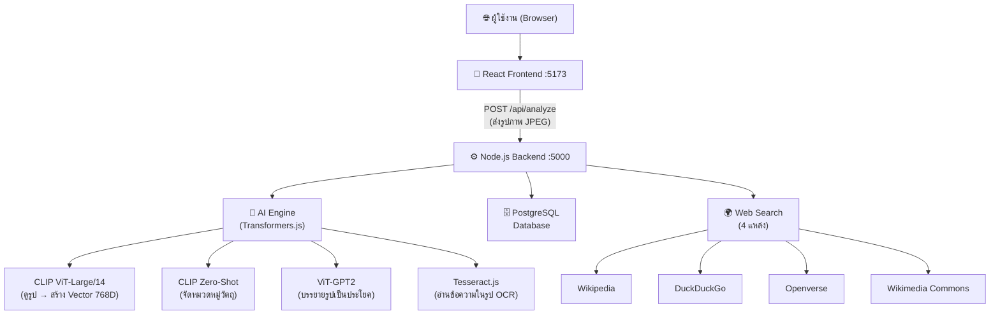
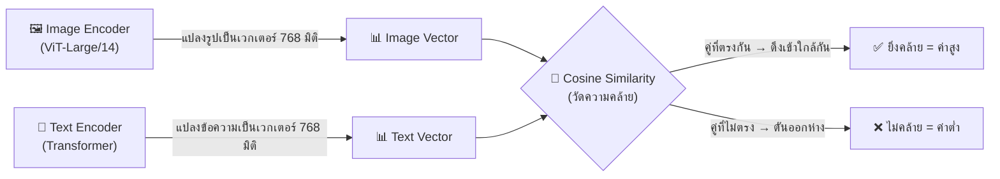
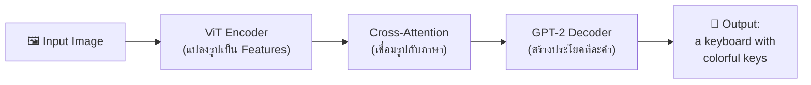
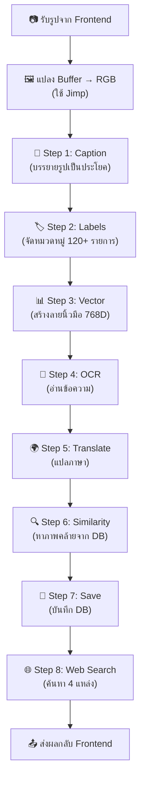

# 🔍 VisionAI — คู่มืออธิบายหลักการทำงานทั้งระบบ (ภาษาไทย)

> เอกสารฉบับสมบูรณ์ที่อธิบายทุกส่วนของระบบ Visual Search Application
> รวมถึงที่มาของ AI Models, วิธีเทรน, และหลักการทำงานของโค้ดทุกบรรทัด

---

## 📐 สถาปัตยกรรมภาพรวม (System Architecture)



### อธิบายง่ายๆ:
1. **ผู้ใช้** อัพโหลดรูป หรือ ถ่ายภาพจากกล้อง
2. **Frontend (React)** แปลงรูปเป็น JPEG → ส่งไปยัง Backend
3. **Backend (Node.js)** รับรูป แล้วส่งให้ AI วิเคราะห์ 4 ขั้นตอน
4. **ผลลัพธ์** ถูกบันทึกลง PostgreSQL + ส่งกลับมาแสดงผลที่หน้าเว็บ

---

## 🧠 AI Models ที่ใช้ — มาจากไหน? เทรนมายังไง?

### 1. CLIP ViT-Large/14 (โมเดลหลัก)

| รายละเอียด | ข้อมูล |
|-----------|--------|
| **ชื่อเต็ม** | Contrastive Language-Image Pre-Training (CLIP) |
| **พัฒนาโดย** | OpenAI (บริษัทที่สร้าง ChatGPT) |
| **เปิดตัว** | มกราคม 2021 |
| **แปลงเป็น JS โดย** | Xenova (ชุมชน Hugging Face) |
| **ที่อยู่โมเดล** | `Xenova/clip-vit-large-patch14` บน Hugging Face |
| **ขนาด** | ~1.2 GB |
| **ค่าใช้จ่าย** | ฟรี 100% ตลอดชีวิต (MIT License) |

#### CLIP ถูกเทรนมายังไง?

```
📊 ข้อมูลการเทรน: รูปภาพ 400 ล้านคู่ (รูป + คำอธิบาย) จากอินเทอร์เน็ต
   เช่น: [รูปแมว] ↔ "a photo of a cat sitting on a couch"
         [รูปรองเท้า] ↔ "Nike Air Max sneakers on white background"
```

**วิธีเทรน — Contrastive Learning (การเรียนรู้แบบเปรียบเทียบ):**



1. **รอบเทรนแต่ละรอบ:** ระบบเอารูป 1 รูป กับ ข้อความ 1 ประโยค มาเปรียบเทียบ
2. **ถ้ารูปกับข้อความเป็นคู่กัน** (เช่น รูปแมว + "a cat") → ระบบลดระยะห่างของ vector ทั้งสอง
3. **ถ้าไม่ใช่คู่กัน** (เช่น รูปแมว + "a car") → ระบบเพิ่มระยะห่าง
4. **ทำซ้ำ 400 ล้านครั้ง** จนโมเดลเข้าใจว่า "รูปอะไร = คำอธิบายอะไร"

#### ViT-Large/14 คืออะไร?

- **ViT** = **V**ision **T**ransformer — แทนที่จะมอง pixel ทีละจุด มันตัดรูปเป็น **patch** (ชิ้นเล็กๆ) ขนาด 14×14 pixel แล้วมองแต่ละ patch เป็น "คำ" เหมือน NLP
- **Large** = ขนาดใหญ่ (24 Transformer layers, 307M parameters)
- **/14** = ขนาด patch = 14×14 pixels (ละเอียดกว่า /32 ที่เป็น 32×32)

#### เราใช้ CLIP ทำอะไรบ้าง? (2 อย่าง)

**งานที่ 1 — Zero-Shot Image Classification (จัดหมวดวัตถุ)**
```
Input:  รูปคีย์บอร์ด
Labels: ["keyboard", "laptop", "mouse", "shoes", ... 120+ รายการ]

วิธีทำ:
1. แปลงรูป → Image Vector (768D)
2. แปลงแต่ละ label → Text Vector (768D)  
3. คำนวณ Cosine Similarity ระหว่างรูปกับทุก label
4. เรียงจากคล้ายมากที่สุด → น้อยที่สุด

Output: keyboard 45%, mechanical keyboard 30%, mouse 8%
```

**งานที่ 2 — Image Embedding (สร้าง Vector 768 มิติ)**
```
Input:  รูปคีย์บอร์ด
Output: [0.0234, -0.1543, 0.3421, ... รวม 768 ตัวเลข]

→ vector นี้คือ "ลายนิ้วมือ" ของรูป
→ รูปที่คล้ายกันจะมี vector ที่ใกล้กัน
→ เก็บลง Database เพื่อใช้หาภาพที่คล้ายกันในอนาคต
```

---

### 2. ViT-GPT2 Image Captioning (บรรยายรูปเป็นประโยค)

| รายละเอียด | ข้อมูล |
|-----------|--------|
| **ชื่อเต็ม** | Vision Transformer + GPT-2 |
| **พัฒนาโดย** | NLP Connect (ชุมชนโอเพ่นซอร์ส) |
| **แปลงเป็น JS โดย** | Xenova |
| **ที่อยู่โมเดล** | `Xenova/vit-gpt2-image-captioning` บน Hugging Face |
| **ขนาด** | ~1 GB |
| **ค่าใช้จ่าย** | ฟรี 100% (Apache 2.0 License) |

#### วิธีเทรน:

```
📊 ข้อมูลเทรน: COCO Dataset (330,000+ รูป พร้อมคำบรรยาย 5 ประโยคต่อรูป)
   เช่น: [รูปแมว] → "a cat is sitting on a red couch in a living room"
         [รูปรถ]  → "a silver car parked on the street near a building"
```

**สถาปัตยกรรม Encoder-Decoder:**



1. **ViT Encoder** → ดูรูปแล้วสรุปเป็น "ความเข้าใจ" (feature vectors)
2. **Cross-Attention** → เชื่อมความเข้าใจจากรูปเข้ากับระบบภาษา
3. **GPT-2 Decoder** → สร้างคำบรรยายทีละคำ เหมือนพิมพ์ทีละตัว

ผลลัพธ์: แทนที่จะบอกแค่ "keyboard" → มันจะบอก **"a computer keyboard with colorful keys on a desk"**

---

### 3. Tesseract.js (อ่านข้อความ OCR)

| รายละเอียด | ข้อมูล |
|-----------|--------|
| **ชื่อเต็ม** | Tesseract Optical Character Recognition |
| **พัฒนาโดย** | Google → โอเพ่นซอร์ส → ชุมชนพอร์ตมาเป็น JS |
| **เวอร์ชัน** | tesseract.js v4+ |
| **ค่าใช้จ่าย** | ฟรี 100% (Apache 2.0) |

#### วิธีเทรน:
- เทรนด้วยภาพตัวอักษรกว่า **100+ ภาษา**
- ใช้ **LSTM Neural Network** (เครือข่ายประสาทเทียมแบบจดจำลำดับ)
- เทรนให้จำ pattern ของตัวอักษรทุกรูปแบบ (ตัวพิมพ์, ลายมือ, ฯลฯ)

---

## 📁 โครงสร้างไฟล์ทั้งโปรเจค

```
visual-search-app/
├── backend/
│   ├── server.js          ← 🧠 หัวใจหลัก (AI + API + DB ทุกอย่างอยู่ที่นี่)
│   ├── .env               ← 🔑 ตั้งค่าฐานข้อมูล
│   └── package.json       ← 📦 dependencies
│
└── frontend/
    └── src/
        ├── App.jsx                      ← 🏠 หน้าหลัก (ประสานงาน)
        └── components/
            ├── ImageUploader.jsx        ← 📸 อัพโหลดรูป / ถ่ายภาพ
            └── SearchResults.jsx        ← 📊 แสดงผลลัพธ์ AI
```

---

## 🔧 อธิบายโค้ดทุกส่วน (Backend — server.js)

### ส่วนที่ 1: ตั้งค่าเริ่มต้น (บรรทัด 1-30)

```javascript
require('dotenv').config();              // โหลดค่าจากไฟล์ .env
const express = require('express');       // เว็บเฟรมเวิร์คสำหรับสร้าง API
const cors = require('cors');             // อนุญาตให้ Frontend คนละ port เรียก API ได้
const multer = require('multer');         // จัดการ file upload (รูปภาพ)
const { Pool } = require('pg');           // เชื่อม PostgreSQL Database
const Tesseract = require('tesseract.js'); // OCR อ่านข้อความในรูป

const upload = multer({ storage: multer.memoryStorage() }); 
// ↑ เก็บรูปไว้ใน RAM (ไม่เซฟลงดิสก์) เพื่อความเร็ว

let clipVisionModel;    // โมเดล CLIP สำหรับสร้าง vector 768 มิติ
let clipProcessor;      // ตัวเตรียมรูปก่อนส่งให้ CLIP
let clipClassifier;     // ตัวจัดหมวดหมู่ Zero-Shot
let captionPipeline;    // ตัวบรรยายรูปเป็นประโยค
let isAiReady = false;  // สถานะ: โมเดลโหลดเสร็จหรือยัง?
```

### ส่วนที่ 2: สร้างฐานข้อมูล (บรรทัด 32-57)

```javascript
async function initDB() {
  const client = await pool.connect();
  
  // ลบตารางเก่า (เพราะ vector เปลี่ยนจาก 512D → 768D)
  await client.query('DROP TABLE IF EXISTS search_results;');
  
  // สร้างตารางใหม่
  await client.query(`
    CREATE TABLE IF NOT EXISTS search_results (
        id SERIAL PRIMARY KEY,           -- รหัสอัตโนมัติ 1, 2, 3...
        image_name VARCHAR(255),          -- ชื่อไฟล์รูป
        detected_labels JSONB,            -- ป้ายชื่อวัตถุที่ AI เจอ (JSON)
        extracted_text TEXT,              -- ข้อความที่ OCR อ่านได้
        translated_text TEXT,             -- คำแปลภาษาไทย
        image_embedding JSONB,            -- vector 768 ตัวเลข (ลายนิ้วมือรูป)
        created_at TIMESTAMP DEFAULT NOW() -- เวลาที่สแกน
    );
  `);
}
```

> **ทำไมเก็บ vector เป็น JSONB?**  
> เพราะ pgvector extension ติดตั้งยากบน Windows → ใช้ JSONB แทน แล้วคำนวณ Cosine Similarity ด้วย JavaScript เอง

### ส่วนที่ 3: โหลด AI Models (บรรทัด 59-93)

```javascript
async function initAI() {
  const transformers = await import('@xenova/transformers');
  // ↑ @xenova/transformers = ไลบรารีที่แปลง Hugging Face models ให้รันใน Node.js ได้
  // ปกติ AI models รันใน Python → Xenova แปลงเป็น ONNX format ให้ใช้ใน JavaScript ได้

  // 1. CLIP ViT-Large/14 — ตัวสร้าง Image Embedding
  clipVisionModel = await CLIPVisionModelWithProjection
    .from_pretrained('Xenova/clip-vit-large-patch14');
  //   ↑ ดาวน์โหลดโมเดลจาก Hugging Face (ครั้งแรก ~1.2GB)
  //     หลังจากนั้นเก็บ cache ในเครื่อง

  // 2. CLIP Zero-Shot Classifier — ตัวจัดหมวดหมู่วัตถุ  
  clipClassifier = await _pipeline(
    'zero-shot-image-classification',    // ← ประเภทงาน
    'Xenova/clip-vit-large-patch14'      // ← ใช้โมเดลตัวเดียวกัน
  );

  // 3. ViT-GPT2 — ตัวบรรยายรูปเป็นประโยค
  captionPipeline = await _pipeline(
    'image-to-text',                      // ← ประเภทงาน
    'Xenova/vit-gpt2-image-captioning'    // ← โมเดลอีกตัว (~1GB)
  );
}
```

> **`from_pretrained` ทำอะไร?**  
> 1. ครั้งแรก: ดาวน์โหลดไฟล์โมเดลจาก `huggingface.co/Xenova/...`  
> 2. เก็บ cache ไว้ในเครื่อง (โฟลเดอร์ `.cache`)  
> 3. ครั้งต่อไป: โหลดจาก cache ทันที ไม่ต้องดาวน์โหลดใหม่

### ส่วนที่ 4: รายชื่อวัตถุ 120+ รายการ (บรรทัด 98-137)

```javascript
const candidate_labels = [
  // อิเล็กทรอนิกส์
  "laptop", "keyboard", "mechanical keyboard", "mouse", ...
  // เสื้อผ้า
  "t-shirt", "hoodie", "sneakers", "running shoes", ...
  // อาหาร
  "pizza", "sushi", "coffee", "cake", ...
  // สัตว์
  "dog", "cat", "bird", "fish", ...
  // ... รวม 120+ รายการ
];
```

> **ทำไมต้องมีรายชื่อ?**  
> Zero-Shot Classification ของ CLIP ทำงานแบบ "เลือกจากตัวเลือกที่ให้"  
> ถ้าไม่มี "keyboard" อยู่ในลิสต์ → AI ไม่มีทางตอบ "keyboard" ได้  
> เลยต้องใส่ให้ครบที่สุด

### ส่วนที่ 5: API หลัก `/api/analyze` (บรรทัด 153-407)

เมื่อผู้ใช้กดปุ่ม "Deep Analyze Image" จะเรียก API นี้ ทำงาน **8 ขั้นตอน:**



#### Step 1: แปลงรูปเป็น RGB (บรรทัด 166-183)

```javascript
// Jimp = ไลบรารี JavaScript ล้วน (ไม่ต้องติดตั้ง C/C++ เหมือน Sharp)
const jimpImage = await Jimp.read(req.file.buffer);

// Jimp ให้ข้อมูลเป็น RGBA (Red, Green, Blue, Alpha)
// แต่ AI ต้องการ RGB เท่านั้น → ตัด Alpha ออก
const rgbaData = jimpImage.bitmap.data;
const rgbData = new Uint8ClampedArray(w * h * 3);

for (let i = 0, j = 0; i < rgbaData.length; i += 4, j += 3) {
  rgbData[j]     = rgbaData[i];     // Red
  rgbData[j + 1] = rgbaData[i + 1]; // Green  
  rgbData[j + 2] = rgbaData[i + 2]; // Blue
  // ↑ ข้าม rgbaData[i + 3] = Alpha (ความโปร่งใส) ไม่เอา
}

// สร้าง RawImage object ที่ Transformers.js เข้าใจ
const rawImage = new RawImage(rgbData, w, h, 3);
// ↑ ข้อมูล RGB, ความกว้าง, ความสูง, จำนวนช่อง (3 = RGB)
```

#### Step 2: AI Caption (บรรทัด 185-189)

```javascript
const captionResult = await captionPipeline(rawImage);
const caption = captionResult[0]?.generated_text || '';
// ตัวอย่างผลลัพธ์: "a computer keyboard with colorful keys on a desk"
```

**ภายใน captionPipeline ทำอะไร?**
1. ViT Encoder ดูรูป → สรุปเป็น feature vectors
2. GPT-2 Decoder อ่าน features → พิมพ์คำทีละคำ: "a" → "computer" → "keyboard" → ...
3. หยุดเมื่อสร้างประโยคครบ

#### Step 3: Zero-Shot Label Classification (บรรทัด 191-194)

```javascript
const classifications = await clipClassifier(rawImage, candidate_labels);
const topLabels = classifications.slice(0, 5); // เอาแค่ 5 อันดับแรก
```

**ภายใน clipClassifier ทำอะไร?**
1. แปลงรูป → vector 768 มิติ
2. แปลง 120+ labels แต่ละอัน → vector 768 มิติ (เช่น "keyboard" → [0.12, -0.34, ...])
3. คำนวณ **Cosine Similarity** ระหว่าง vector รูป กับ vector ของแต่ละ label
4. เรียงลำดับ: label ที่คล้ายรูปมากที่สุด → น้อยที่สุด

#### Step 4: สร้าง Vector 768D (บรรทัด 196-201)

```javascript
const imageInputs = await clipProcessor(rawImage);  // เตรียมรูป (resize, normalize)
const { image_embeds } = await clipVisionModel(imageInputs);  // สร้าง vector
const vectorArray = Array.from(image_embeds.data);  // แปลงเป็น JS Array [768 ตัวเลข]
```

> **Vector 768 มิตินี้เปรียบเหมือน "ลายนิ้วมือ" ของรูป:**
> - รูปแมว 2 ตัว → vector ใกล้กัน
> - รูปแมว vs รูปรถ → vector ห่างกัน
> - ใช้เปรียบเทียบหาภาพที่คล้ายกันได้!

#### Step 5: OCR อ่านข้อความ (บรรทัด 203-206)

```javascript
const tesseractResult = await Tesseract.recognize(req.file.buffer, 'eng');
const extractedText = tesseractResult.data.text.trim();
```

#### Step 6: Cosine Similarity — หาภาพคล้ายจาก Database (บรรทัด 232-259)

```javascript
// สูตร Cosine Similarity:
//
//              A · B           Σ(Ai × Bi)
// cos(θ) = ─────────── = ─────────────────────
//           ||A|| × ||B||   √Σ(Ai²) × √Σ(Bi²)
//
// ค่า = 1.0  → เหมือนกัน 100%
// ค่า = 0.0  → ไม่เกี่ยวข้องกันเลย
// ค่า = -1.0 → ตรงข้ามกันสิ้นเชิง

function cosineSimilarity(A, B) {
  let dotProduct = 0, normA = 0, normB = 0;
  for (let i = 0; i < A.length; i++) {   // วนลูป 768 รอบ
    dotProduct += A[i] * B[i];            // ผลคูณ dot product
    normA += A[i] * A[i];                 // ขนาดเวกเตอร์ A²
    normB += B[i] * B[i];                 // ขนาดเวกเตอร์ B²
  }
  return dotProduct / (Math.sqrt(normA) * Math.sqrt(normB));
}

// เปรียบเทียบ vector ของรูปใหม่ กับทุก vector ที่เก็บไว้ในฐานข้อมูล
const scoredScans = allScansResult.rows.map(row => {
  const dbVec = JSON.parse(row.image_embedding);      // ดึง vector จาก DB
  const score = cosineSimilarity(vectorArray, dbVec);  // คำนวณความคล้าย
  return { ...row, similarity_score: score };
});

scoredScans.sort((a, b) => b.similarity_score - a.similarity_score); // เรียงมาก→น้อย
visuallySimilar = scoredScans.slice(0, 3); // เอา 3 อันที่คล้ายมากที่สุด
```

#### Step 7: บันทึกลง Database (บรรทัด 261-266)

```javascript
await pool.query(
  'INSERT INTO search_results (...) VALUES ($1, $2, $3, $4, $5)',
  [fileName, JSON.stringify(topLabels), extractedText, translatedText, JSON.stringify(vectorArray)]
);
// ↑ เก็บทุกอย่าง: ชื่อไฟล์, labels, ข้อความ OCR, คำแปล, vector 768D
```

#### Step 8: ค้นหาจาก 4 แหล่งบนอินเทอร์เน็ต (บรรทัด 268-388)

```javascript
// ใช้ caption เป็น search query (แม่นกว่าใช้แค่ label เดียว)
const searchQuery = caption || topLabels[0]?.description;
// เช่น: "a computer keyboard with colorful keys" ← แม่นมาก!

// ยิง 4 API พร้อมกัน (Promise.all = ไม่ต้องรอทีละตัว)
const [wiki, ddg, openverse, commons] = await Promise.all([
  wikiSearch(),      // Wikipedia: บทความ + รูปภาพ
  ddgSearch(),       // DuckDuckGo: ผลค้นหาเว็บ
  openverseSearch(), // Openverse: รูปภาพ Creative Commons ฟรี
  commonsSearch()    // Wikimedia Commons: รูปภาพสื่อฟรี
]);
```

| แหล่ง | API | ต้อง Key? | ให้อะไร |
|-------|-----|:---------:|--------|
| **Wikipedia** | `en.wikipedia.org/w/api.php` | ❌ ฟรี | บทความ + thumbnail |
| **DuckDuckGo** | `api.duckduckgo.com` | ❌ ฟรี | Instant Answers + Related Topics |
| **Openverse** | `api.openverse.org` | ❌ ฟรี | รูปภาพ Creative Commons |
| **Wikimedia** | `commons.wikimedia.org/w/api.php` | ❌ ฟรี | รูปภาพ/สื่อจาก Wikimedia |

---

## 📱 อธิบายโค้ด Frontend

### App.jsx — ตัวประสานงานหลัก

```javascript
// ทุก 5 วินาที เช็คว่า Backend โหลด AI เสร็จหรือยัง
useEffect(() => {
  const checkHealth = async () => {
    const res = await fetch('http://localhost:5000/api/health');
    const data = await res.json();
    setBackendReady(data.ai_ready);  // ← true เมื่อ AI โหลดเสร็จ
  };
  const int = setInterval(checkHealth, 5000);
}, []);

// เมื่อกดปุ่ม "Deep Analyze Image"
const handleSearch = async (file) => {
  const formData = new FormData();
  formData.append('image', file);
  
  const response = await fetch('http://localhost:5000/api/analyze', {
    method: 'POST',
    body: formData    // ส่งรูปเป็น multipart/form-data
  });
  
  const data = await response.json();
  setResults(data);   // เก็บผลลัพธ์ → ส่งให้ SearchResults แสดง
};
```

### ImageUploader.jsx — อัพโหลดรูป + ถ่ายภาพ

```javascript
// ฟังก์ชัน convertToJpeg — แปลงรูปทุกชนิดให้เป็น JPEG
// (เพราะ Backend รองรับ JPEG ดีที่สุด)
const convertToJpeg = (file) => {
  return new Promise((resolve) => {
    const img = new Image();
    img.onload = () => {
      const canvas = document.createElement('canvas');
      canvas.width = img.width;
      canvas.height = img.height;
      const ctx = canvas.getContext('2d');
      ctx.drawImage(img, 0, 0);
      canvas.toBlob((blob) => {
        resolve(new File([blob], 'image.jpg', { type: 'image/jpeg' }));
      }, 'image/jpeg', 0.92);  // คุณภาพ 92%
    };
    img.src = URL.createObjectURL(file);
  });
};
```

> **ทำไมต้องแปลง?**  
> รูป WebP, AVIF, BMP ไม่ support โดย Jimp ที่ backend  
> แต่ HTML5 Canvas อ่านได้ทุกชนิด → ใช้ Canvas แปลงเป็น JPEG ก่อนส่ง

### SearchResults.jsx — แสดงผลลัพธ์

```javascript
// 1. แสดง AI Caption (ประโยคบรรยายรูป)
{data.caption && (
  <div>"a keyboard with colorful keys on a desk"</div>
)}

// 2. แสดง Tags (label badges พร้อม % confidence)
{data.labels.map(lbl => (
  <div>KEYBOARD 45%</div>
))}

// 3. แสดงผลค้นหาจาก 4 แหล่งบนเว็บ
// แต่ละ card มี badge สีต่างกันตามแหล่งที่มา:
const sourceColors = {
  Openverse: '#10b981',  // 🟢 เขียว
  Wikimedia: '#a855f7',  // 🟣 ม่วง
  Wikipedia: '#3b82f6',  // 🔵 น้ำเงิน
  DuckDuckGo: '#f59e0b'  // 🟡 เหลือง
};
```

---

## 🔐 ความเป็นส่วนตัว (Privacy)

| ประเด็น | คำตอบ |
|--------|-------|
| รูปถูกส่งไปไหน? | **ไม่ส่งไปไหนเลย!** ประมวลผลในเครื่องของคุณ 100% |
| AI Models อยู่ที่ไหน? | ดาวน์โหลดมาเก็บในเครื่อง (ครั้งแรกครั้งเดียว) |
| ต้องใช้อินเทอร์เน็ตไหม? | AI ทำงานได้ออฟไลน์ แต่ Web Search ต้องใช้เน็ต |
| เสียเงินไหม? | **ฟรีทั้งหมด** — ไม่มี API Key, ไม่มี Quota, ไม่มี Monthly Fee |

---

## 📊 สรุปเปรียบเทียบ AI Models

| Model | งาน | พัฒนาโดย | ข้อมูลเทรน | ขนาด | แม่นยำ |
|-------|-----|---------|-----------|------|:------:|
| **CLIP ViT-L/14** | ดูรูป → Label + Vector | OpenAI | 400M คู่รูป-ข้อความ | ~1.2GB | ⭐⭐⭐⭐⭐ |
| **ViT-GPT2** | ดูรูป → ประโยค | NLP Connect | COCO 330K รูป | ~1GB | ⭐⭐⭐⭐ |
| **Tesseract** | ดูรูป → อ่านตัวอักษร | Google (Open) | 100+ ภาษา | ~15MB | ⭐⭐⭐⭐ |

---

## 🧮 สรุป Flow ทั้งหมด ตั้งแต่กดปุ่มจนเห็นผล

```
1. ผู้ใช้อัพรูปรองเท้า Nike 👟
2. Frontend แปลง → JPEG → POST ไปยัง Backend
3. Backend รับรูป → Jimp แปลง RGBA → RGB
4. 🧠 ViT-GPT2 บรรยาย: "a pair of white sneakers on a table"
5. 🏷️ CLIP จัดหมวด: sneakers 52%, running shoes 28%, shoes 12%
6. 📊 CLIP สร้าง vector: [0.023, -0.154, 0.342, ... ×768]
7. 📝 Tesseract อ่านข้อความ: "Nike Air Max 90" (ถ้ามี)
8. 🔍 Cosine Sim: เทียบกับรูปเก่าใน DB → "87% คล้ายรูป #5"
9. 💾 บันทึกทุกอย่างลง PostgreSQL
10. 🌐 ค้นหา "a pair of white sneakers" จาก 4 เว็บไซต์
11. 📤 ส่งผลทั้งหมดกลับ → Frontend แสดงผล!
```

**ใช้เวลาทั้งหมด: ~5-15 วินาทีต่อรูป** (ขึ้นอยู่กับ CPU)

---

> 📌 **หมายเหตุ:** ทุก AI Model ที่ใช้ดาวน์โหลดจาก [Hugging Face](https://huggingface.co) ซึ่งเป็นแพลตฟอร์มโอเพ่นซอร์สที่ใหญ่ที่สุดในโลกสำหรับ AI Models — ใช้ฟรี ไม่มีค่าใช้จ่าย ไม่มี API Quota
